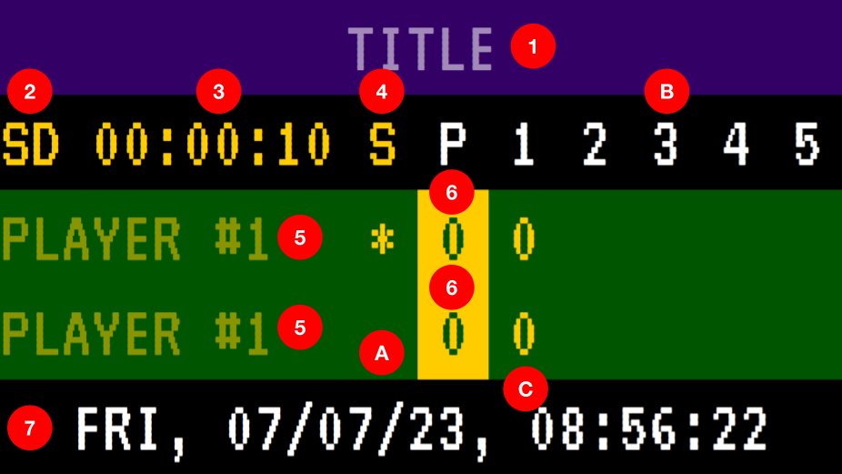

# Tennis Board
Tennis Board for Raspberry Pi.

# Usage
* These are the final user instructions.
* These instructions are valid when the installation is complete and the device has been rebooted and connected to a screen.

## The Board


The board is a tennis display, that allows you to set titles, players names, a match clock and, calculate and displaying scores following Standard and Grand Slam rules. It can be configured remotely by another device like a computer, tablet or phone via the web browser.

### Access to the board
* Plug the machine to a TV or HDMI compatible screen.
* Plug the machine to power.
* Wait until the board is showing on the screen (yeah, it's a small device, so give it around 3 minutes).
* Assuming you are in the same network, please user your phone/table/computer browser to enter `http://raspberrypi`, you will be able to control the board from there.

### Controls

1. **Title:** Displays the name of the event. Click and type the title of the event. When you are done click enter.
2. **Match Types:** Display the rules currently in use. Click to toggle among different types of match rules. You can choose between:
  * SD: Standard/Normal. Race to 2 sets. Includes advantage, and tie breaks at 6-6.
  * US: US Open. Race to 3 sets. Includes advantage, and tie breaks at 6-6.
  * AU: Australia Open. Race to 3 sets. Includes advantage, and tie breaks at 6-6.
  * RG: Roland Garros. Race to 3 sets. Includes advantage, and tie breaks at 6-6. 5th set doesn't have tie break; winner defined by difference of two games.
  * WB: Wimbledon. Race to 3 sets. Includes advantage, and tie breaks at 6-6. 5th set has tie break at 12-12.
3. **Match Clock**: Display the time elapsed since the start of the game. Click to reset.
4. **Serve Switch**: Toggles the player at serve (See A). Click to switch between players.
5. **Player Name**: Displays the name of the player. Click and type the name of the player. When you are done click enter.
6. **Points**: Display the points of the player. Click to add a point. It automatically calculates and displays advantage and tie break.
7. **Clock and Reset**: It displays the current date and time. Tap 3 times in less than a second to reset the entire game.

### Displays

  A. **Serve**: Displays who is serving. It toggles automatically between players depending of the situation.
  * \* (star): Shows the player serving in a normal game.
  * T : Shows the player serving in a tie break game.
  * W : Show the winner. All the controls but (7) are disabled when this symbol is displaying.
    
  B. **Game and Set**: Displays the number of sets associated with the score, and also indicates where the game points are located.

  C. **Sets**: Displays the score for each set, for each player.

### Power off
* Just disconect the device from power and you are done.

# Installation
These instructions where tested on Raspbian Lite 32 on a Raspberry Pi 3 B. 

## Dependencies

* NGINX
* Mosquitto
* Chromium

Please execute 

```
sudo apt update; sudo apt upgrade; sudo apt install -y nginx mosquitto mosquitto-client libwebsockets-dev build-essential libcjson1 libcjson-dev
```
## Repository configuration
Please place the repository folder on `/var/www/`. You may need to have elevated privileges to do so.

## NGINX Configuration
Please configure `/etc/nginx/site-enabled/default` the following way:
```
upstream websocket{
	server localhost:9001;
}

server {
	listen 80 default_server;
	listen [::]:80 default_server;

	root /var/www/tennis-board;
	index index.html index.htm index.nginx-debian.html;

	server_name _;

	location / {
		try_files $uri $uri/ =404;
	}

	location /websocket{
		proxy_pass http://websocket;
		proxy_http_version 1.1;
		proxy_set_header Upgrade $http_upgrade;
		proxy_set_header Connection "upgrade";
		proxy_set_header Host $host;
	}
}
```

## Enable Mosquitto
Use `sudo service mosquitto enable`.

## Mosquitto Configuration
Edit `/etc/mosquitto/mosquitto.conf` the following way:
```
# Place your local configuration in /etc/mosquitto/conf.d/
#
# A full description of the configuration file is at
# /usr/share/doc/mosquitto/examples/mosquitto.conf.example

listener 9001
protocol websockets

pid_file /run/mosquitto/mosquitto.pid

persistence true
persistence_location /var/lib/mosquitto/

log_dest file /var/log/mosquitto/mosquitto.log

include_dir /etc/mosquitto/conf.d
allow_anonymous true
```
## Open Chromium at the startup
Config `~/.config/lxsession/LXDE-pi/autostart` the following way:

```
@xset s off
@xset -dpms
@xset s noblank
@chromium-browser --noerrdialogs --disable-infobars --kiosk --use-gl=egl http://localhost &
```
## Restart
With all of this, you should be able to run the board when rebooting with `sudo reboot now`.

# To-Do
* Adding hotspot to raspberry pi.
* Adding synchronization between devices when connection is lost.
* Store the display font locally

